# PnPSearchFeaturePack - Step by step installation

## Summary

In this article you will find the guided procedure to deploy The PnP Search Feature Pack on your site/tenant and setup your first search pages based on it.

> The solution can be deployed either in the Tenant app catalog or in a site collection app catalog.
> In this documentation, we will describe the procedure to deploy the package in a [site collection app catalog](https://learn.microsoft.com/en-us/sharepoint/dev/general-development/site-collection-app-catalog)

### Prerequisites

1. You've already downloaded and deployed PnP Modern Search package in your tenant/site collection app catalog
   Target version for PnP Modern Search is [4.8.0](https://github.com/microsoft-search/pnp-modern-search/releases/tag/4.8.0)
2. You've created the Site Collection App Catalog in your site. If not please have a look on this article from MS Learn or on the Add-PnPSiteCollectionAppCatalog cmdlet from PnP PowerShell

### STEP 1: Download and put your package in your app catalog

1. Get the latest release [here](https://github.com/RedsenCH/PnPSearchFeaturePack/releases)

2. Once package is downloaded, Open your SharePoint Site and then go to the app catalog:
   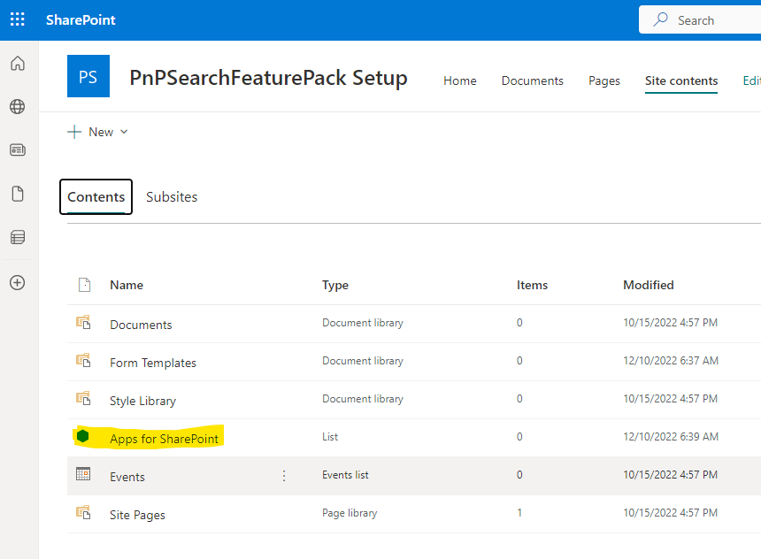

3. Upload the package you've downloaded: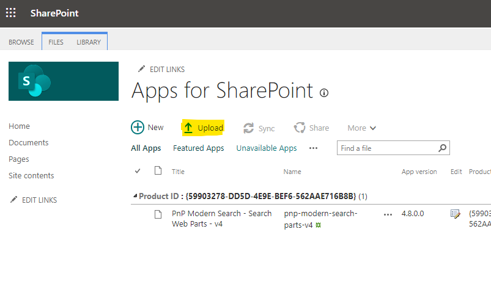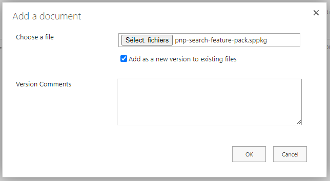

4. Then click on "Deploy":
   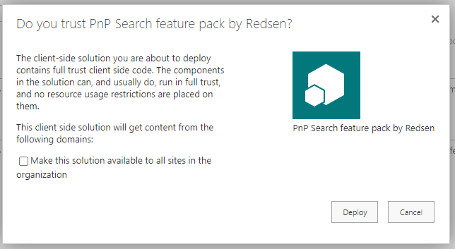

### STEP 2: Activite the app on your site

Now add the app on your site.

1. Go to site homepage and add an app:
   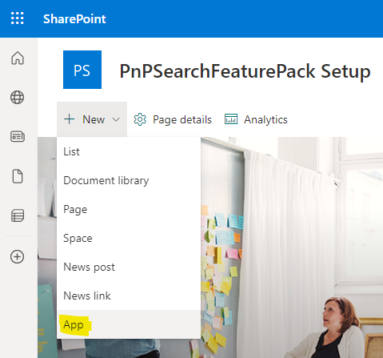

2. Find the app in your app catalog and click "Add":
   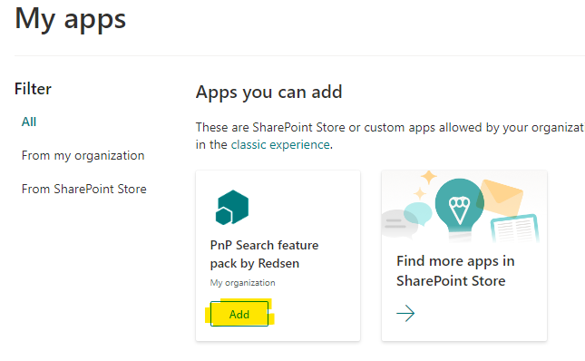

3. The extension library is now activated on your site. You can find it directly from the site contents:
   

### STEP 3: Create your first Search page

1. Create a page, name it as you want and choose the template you want

2. Once done add following PnP Search components:
   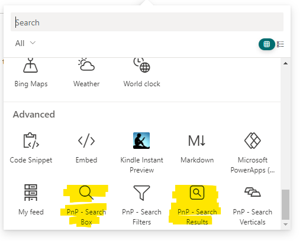

3. You should have something like this:
   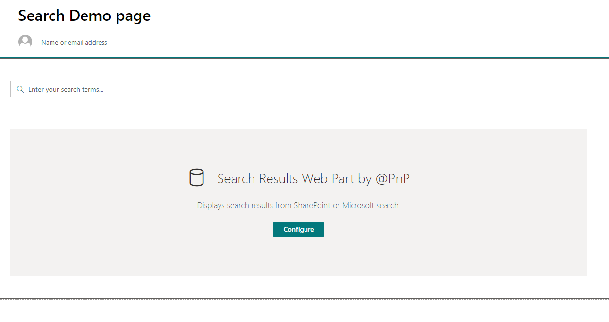

### STEP 4: Configure the library

1. Edit the Search Results Webpart parameters and go to last tab
   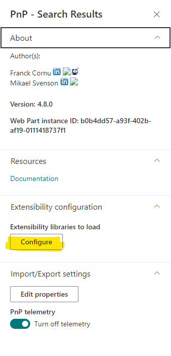

2. Add a news extensibility with following parameters:

- Name/Purpose : PnPSearchFeaturePackLibrary
- Manifest GUID /!\IMPORTANT/!\: 730e5f22-22c9-4f09-bce7-54502e6a2cd9
  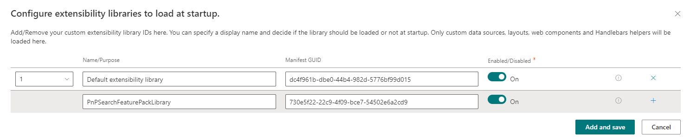

3. Click on "Add and Save"

4. Save the page

> **NOTE: It's important to save the page at this step. It will force the PnP Search Result Webpart to dynamically load the Extensibility library we've just configured**

### STEP 5: Ensure the library is well configured

1. Edit the page

2. Edit the Search Results Webpart parameters

3. On first tab, select "SharePoint Search" in "Available Datasources":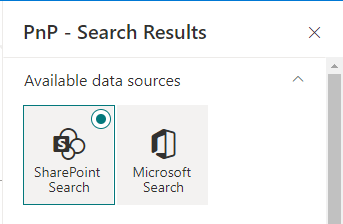

4. Then, go to Tab 2, you should see "News cards Layout" in the available layouts: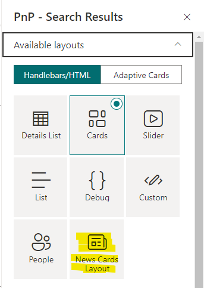

5. Installation is finished. Enjoy!

Please read the whole documentation to discover all the components and layouts available ;-)
